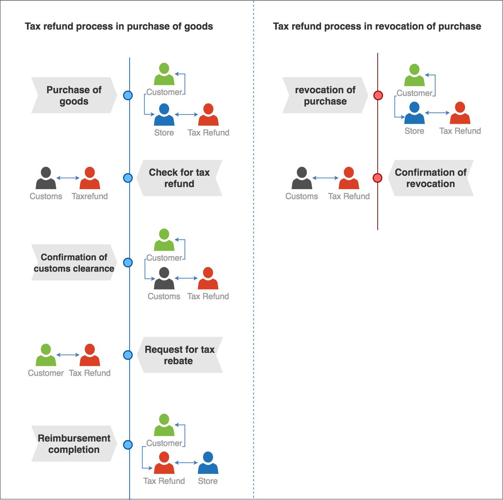
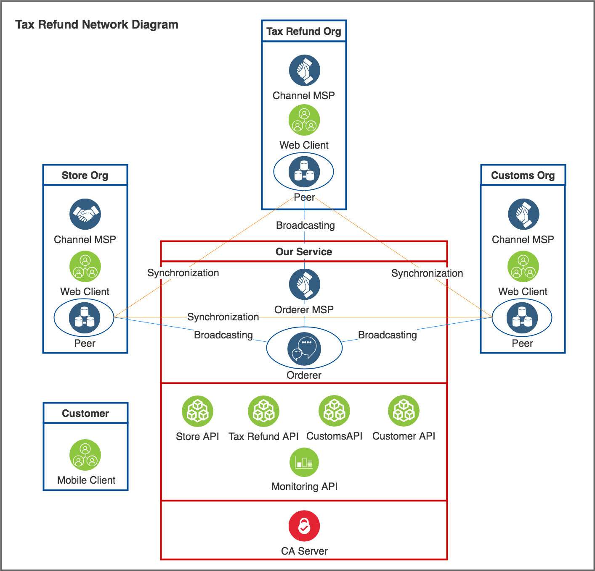

Tax Refund Service with Hyperledger Fabric
=======
Tax refund for purchase of goods includes the kinds of situations that illustrate the inefficiencies and distrust in real-world processes. So, we are going to provide the service that blockchain is implemented.

Project Introduction
--------

We are now in the process of going online tax refund service. We hope to simplify the current real process using our workflow. Implemented on a blockchain, the sequences of transactions following steps can be carried out an irrevocable and non-repudiable manner. Therefore, we built a block-chain network by utilizing HyperLedger which is suitable for business model.

Tax Refund Business Flow
--------

There are three categories of participants in tax refund network, representing customs, tax refund company, store. The terms in this set refer to the roles an entity can assume in a tax refund purchase. Chain Code (Smart Contract) can fulfill the contract between the parties, such as purchases, exports, and request for tax reimbursements, without documentation. 

<Figure 1 - Tax refund process>

The transaction in our workflow are as follow.

1. Purchase of goods: Customer purchases goods at appointed duty free shop		 
2. Check for tax refund: it is confirmed whether the purchase details are subject to refund from the Korea Customs Service. 
3. Confirmation of customs clearance: Customs approves the goods customer purchased for export. 
4. Request for tax rebate: The customer asks the tax refund company to rebate the amount on the approved item. 
5. Reimbursement completion: The tax refund company pays the refund amount for the customer's request. 

The transaction state recorded in the ledger contains the signature value of the client and the peer that is endorsing the transaction.

Design of Tax refund network
--------

    <Figure 2 - Tax refund network Diagram>
    
 As we stated previously, our network consist of three organization customs, tax refund company, store, as a peer node respectively. Additionally, Each entity and customer users obtain the right to submit transactions or read the ledger state from it organization in the role of a client. Apart from the peers, our network consists of one MSP for each of the three organizations, and an ordering service running in kafka mode. 

License
--------

[Apache 2.0](LICENSE)